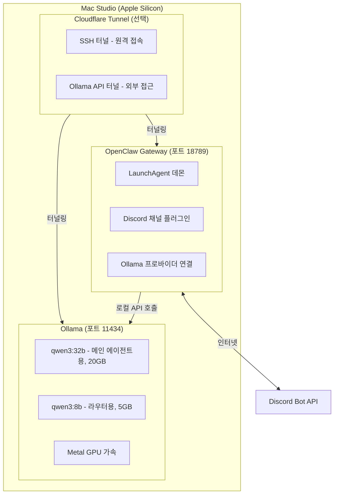

# macOS (Apple Silicon) 환경 OpenClaw + Discord + Ollama 연동 가이드

> **Mac Studio (Apple Silicon) 환경에서 OpenClaw을 설치하고, 로컬 LLM(Ollama)과 연결한 뒤, Discord 봇으로 실시간 운영하는 전체 과정을 담은 실전 가이드입니다.**
>
> 이 가이드는 2026년 4월 기준, 실제 설치 과정에서 발생한 모든 문제와 해결 방법을 포함합니다.

---

## 목차

- [전체 아키텍처](#전체-아키텍처)
- [사전 요구사항](#사전-요구사항)
- [PHASE 1: macOS 환경 구축](#phase-1-macos-환경-구축)
- [PHASE 2: Ollama 설치 및 모델 서빙](#phase-2-ollama-설치-및-모델-서빙)
- [PHASE 3: OpenClaw 설치 및 설정](#phase-3-openclaw-설치-및-설정)
- [PHASE 4: Discord 봇 생성 및 연결](#phase-4-discord-봇-생성-및-연결)
- [PHASE 5: 에이전트 행동 규칙 설정](#phase-5-에이전트-행동-규칙-설정)
- [PHASE 6: Cloudflare Tunnel 연동 (선택)](#phase-6-cloudflare-tunnel-연동-선택)
- [트러블슈팅 가이드](#트러블슈팅-가이드)
- [비용 및 보안](#비용-및-보안)
- [명령어 치트시트](#명령어-치트시트)

---

## 전체 아키텍처



---

## 사전 요구사항

| 항목 | 요구사항 |
|------|----------|
| 하드웨어 | Apple Silicon Mac (M1 이상) |
| RAM | 최소 16GB, 32b 모델 기준 32GB 이상 권장 |
| OS | macOS 15+ (Sequoia 이상 권장) |
| 인터넷 | 안정적인 인터넷 연결 (모델 다운로드용) |
| Discord | Discord 계정 + 서버 관리자 권한 |

> 이 가이드는 Mac Studio M3 Ultra 256GB 환경에서 검증되었습니다.

---

## PHASE 1: macOS 환경 구축

### 1-1. Homebrew 설치

터미널을 열고:

```bash
/bin/bash -c "$(curl -fsSL https://raw.githubusercontent.com/Homebrew/install/HEAD/install.sh)"
```

설치 후 PATH 설정:

```bash
echo 'eval "$(/opt/homebrew/bin/brew shellenv)"' >> ~/.zprofile
eval "$(/opt/homebrew/bin/brew shellenv)"
```

확인:

```bash
brew --version
```

### 1-2. Node.js 설치

OpenClaw는 Node.js 22 이상을 요구합니다:

```bash
brew install node
node --version    # v22.x.x 이상 확인
```

### 1-3. 기타 도구 설치

```bash
brew install tmux    # 백그라운드 세션 관리용
```

---

## PHASE 2: Ollama 설치 및 모델 서빙

### 2-1. Ollama 설치

GUI 앱 설치 (트레이 아이콘 + CLI 모두 제공):

```bash
# 공식 macOS 앱 다운로드
curl -fsSL -o /tmp/Ollama-darwin.zip https://ollama.com/download/Ollama-darwin.zip
cd /tmp && unzip -o Ollama-darwin.zip -d /tmp/ollama-app
cp -R /tmp/ollama-app/Ollama.app /Applications/
rm -rf /tmp/ollama-app /tmp/Ollama-darwin.zip

# 앱 실행
open /Applications/Ollama.app
```

### 2-2. 모델 다운로드

```bash
# 메인 에이전트용 (32b, 약 20GB)
ollama pull qwen3:32b

# 라우터/경량 작업용 (8b, 약 5GB)
ollama pull qwen3:8b
```

> Qwen3가 현재 Ollama에서 function calling(tool use) 안정성이 가장 좋습니다.
> Qwen3.5는 Ollama의 tool calling 포맷 불일치 이슈가 있어 비추천합니다.
> 참고: https://github.com/ollama/ollama/issues/14493

### 2-3. 환경변수 설정 (중요)

Ollama는 기본적으로 localhost 요청만 허용합니다. Cloudflare Tunnel이나 외부에서 접근하려면 반드시 `OLLAMA_ORIGINS` 설정이 필요합니다.

LaunchAgent로 영구 등록:

```bash
cat > ~/Library/LaunchAgents/com.ollama.serve.plist << 'EOF'
<?xml version="1.0" encoding="UTF-8"?>
<!DOCTYPE plist PUBLIC "-//Apple//DTD PLIST 1.0//EN" "http://www.apple.com/DTDs/PropertyList-1.0.dtd">
<plist version="1.0">
<dict>
    <key>Label</key>
    <string>com.ollama.serve</string>
    <key>ProgramArguments</key>
    <array>
        <string>/Applications/Ollama.app/Contents/Resources/ollama</string>
        <string>serve</string>
    </array>
    <key>EnvironmentVariables</key>
    <dict>
        <key>OLLAMA_ORIGINS</key>
        <string>*</string>
        <key>OLLAMA_HOST</key>
        <string>0.0.0.0:11434</string>
        <key>OLLAMA_NUM_PARALLEL</key>
        <string>8</string>
    </dict>
    <key>RunAtLoad</key>
    <true/>
    <key>KeepAlive</key>
    <true/>
    <key>StandardOutPath</key>
    <string>/tmp/ollama.log</string>
    <key>StandardErrorPath</key>
    <string>/tmp/ollama.err</string>
</dict>
</plist>
EOF
```

Ollama 앱을 종료하고 LaunchAgent로 시작:

```bash
pkill -f 'Ollama'
launchctl load ~/Library/LaunchAgents/com.ollama.serve.plist
```

확인:

```bash
curl http://localhost:11434/
# 응답: Ollama is running
```

> 환경변수 설명:
> - `OLLAMA_ORIGINS=*`: 모든 Origin 허용 (Cloudflare Tunnel 접근용, 필수)
> - `OLLAMA_HOST=0.0.0.0:11434`: 전체 인터페이스 바인딩
> - `OLLAMA_NUM_PARALLEL=8`: 동시 8개 요청 처리 (에이전트 다중 호출 대응)

### 2-4. Ollama API 테스트

```bash
# 모델 목록
curl http://localhost:11434/api/tags

# 채팅 테스트 (OpenAI 호환 API)
curl http://localhost:11434/v1/chat/completions \
  -H "Content-Type: application/json" \
  -d '{
    "model": "qwen3:32b",
    "messages": [{"role": "user", "content": "안녕하세요"}],
    "max_tokens": 100
  }'
```

---

## PHASE 3: OpenClaw 설치 및 설정

### 3-1. OpenClaw CLI 설치

> 버전 호환성 주의: Discord 플러그인과 CLI 버전이 맞아야 합니다.
> 2026.4.14에서 Discord 플러그인 API가 변경되어 런타임 크래시가 발생합니다.
> 안정적인 Discord 연동을 위해 2026.3.13 설치를 권장합니다.

```bash
npm install -g openclaw@2026.3.13 --ignore-scripts
openclaw --version    # OpenClaw 2026.3.13 확인
```

> `--ignore-scripts`를 사용하는 이유: WhatsApp용 libsignal 의존성이 SSH git dep으로 되어있어, SSH 키 없이 일반 설치 시 실패합니다. Discord만 사용하면 이 의존성이 불필요하므로 skip해도 됩니다.

### 3-2. 온보딩

```bash
openclaw onboard --install-daemon
```

온보딩 선택지 가이드:

| 단계 | 질문 | 권장 선택 | 이유 |
|------|------|-----------|------|
| 1 | Onboarding mode | Manual | 세부 설정 제어 가능 |
| 2 | What to set up? | Local gateway (this machine) | 로컬 실행 |
| 3 | Model/auth provider | Ollama (local) | 로컬 모델 사용 |
| 4 | Default model | ollama/qwen3:32b | 메인 에이전트용 |
| 5 | Gateway port | 18789 (기본값) | — |
| 6 | Gateway bind | Loopback (127.0.0.1) | 로컬 전용 |
| 7 | Gateway auth | Token | 보안 |
| 8 | Tailscale | Off | 로컬 테스트에는 불필요 |
| 9 | Hatch your bot? | Hatch in TUI | 부트스트랩 완료 필수 |

### 3-3. TUI에서 부트스트랩 완료

온보딩 마지막에 TUI에서 봇과 첫 대화를 진행합니다:

```
기본값으로 채우고 BOOTSTRAP.md 지워줘
```

> 부트스트랩이 PENDING 상태면 Discord에서 자동 응답이 안 됩니다!

확인:

```bash
openclaw status --all
# Agents: 1 total · 0 bootstrapping ← DONE이어야 함
```

### 3-4. 모델 설정

온보딩에서 Ollama를 선택하지 않았다면 수동 설정:

```bash
openclaw models set ollama/qwen3:32b
```

확인:

```bash
openclaw models status
# Default: ollama/qwen3:32b
```

---

## PHASE 4: Discord 봇 생성 및 연결

### 4-1. Discord Developer Portal에서 봇 생성

1. [Discord Developer Portal](https://discord.com/developers/applications) 접속
2. New Application → 이름 입력
3. 좌측 Bot 메뉴 → Reset Token → 토큰을 안전한 곳에 저장

### 4-2. Privileged Gateway Intents 활성화

Bot 설정 페이지 → Privileged Gateway Intents:

- Message Content Intent (필수)
- Server Members Intent (권장)

Save Changes 클릭

> Message Content Intent가 꺼져있으면 봇이 서버에 접속은 되지만 메시지를 읽지 못합니다.

### 4-3. 봇을 Discord 서버에 초대

1. 좌측 OAuth2 → URL Generator
2. SCOPES: `bot` 체크
3. BOT PERMISSIONS 체크:
   - View Channels
   - Send Messages
   - Read Message History
   - Embed Links
   - Attach Files
   - Add Reactions
4. 생성된 URL 복사 → 브라우저에서 열기 → 서버 선택 → 승인

### 4-4. OpenClaw에 Discord 연결

```bash
# Discord 플러그인 활성화
openclaw plugins enable discord

# 게이트웨이 재시작
openclaw gateway restart

# Discord 채널 추가 (한 줄로 입력)
openclaw channels add --channel discord --name "discord" --token "봇_토큰_여기_붙여넣기"
```

> `\`로 줄바꿈하면 에러가 발생할 수 있습니다. 반드시 한 줄로 입력하세요.

### 4-5. Guild(서버) 및 채널 설정

`~/.openclaw/openclaw.json`을 편집합니다:

```bash
nano ~/.openclaw/openclaw.json
```

`channels` > `discord` 섹션에 guild 설정 추가:

```json
"channels": {
    "discord": {
      "enabled": true,
      "token": "봇토큰...",
      "groupPolicy": "allowlist",
      "dmPolicy": "open",
      "allowFrom": ["*"],
      "guilds": {
        "서버ID": {
          "requireMention": false,
          "channels": {
            "채널ID": {}
          }
        }
      }
    }
}
```

> guild 안에 `"enabled": true`를 넣지 마세요! Unrecognized key 에러가 발생합니다.
>
> `requireMention: false`로 설정하면 멘션 없이도 해당 채널의 모든 메시지에 응답합니다.
> `channels`로 특정 채널만 지정하면 다른 채널에서는 응답하지 않습니다.

저장 후:

```bash
openclaw gateway stop
openclaw gateway install --force
```

### 4-6. 연결 확인

```bash
openclaw channels status
```

정상 출력:

```
Discord │ ON │ OK │ token config · accounts 1/1
```

> `disconnected`로 표시되더라도 gateway 로그에서 "logged in to discord"가 보이면 실제로는 연결된 상태일 수 있습니다.
> health-monitor가 5분 주기로 자동 재연결을 시도합니다. 처음 시작 후 최대 5분 대기하세요.

### 4-7. Discord 테스트

설정한 채널에서 메시지를 보내면 봇이 응답합니다.

---

## PHASE 5: 에이전트 행동 규칙 설정

에이전트가 끝없이 삽질하지 않도록 CLAUDE.md에 행동 규칙을 설정합니다:

```bash
cat > ~/CLAUDE.md << 'EOF'
# Rules

## 언어
- 반드시 한국어로 응답할 것
- 영어로 응답하지 말 것

## 응답 시간 관리
- 한 문제에 10분 이상 소요 시 중간 보고 필수
- Agent 서브태스크 실패 2회 시 사용자에게 보고 후 대기
- 소스코드 직접 패치보다 공식 방법 우선

## CUD 전 검토받기
어떤 환경에서든 Create, Update, Delete 작업을 적용하기 전에 반드시:
1. 변경 내용 요약을 사용자에게 먼저 보여줄 것
2. 사용자 승인을 받은 후 적용할 것

## 제공 전 검증하기
작업 완료를 사용자에게 보고하기 전에 반드시:
1. 실제 동작 확인 (로그, 테스트 실행 등)
2. 검증 결과를 포함해서 보고할 것

## 디스코드 응답 규칙
- 반말 금지, 존댓말 사용
- --- 구분선, **볼드** 쓰지 말 것
- 넘버링 사용
- 진행 상태 명확히 전달
EOF
```

> 이 규칙이 없으면 에이전트가 스스로 판단해서 수십 분간 삽질할 수 있습니다.
> 실제로 Discord 플러그인 호환성 문제를 에이전트가 12분간 144회 tool 호출하며 소스코드 직접 패치를 시도했습니다.

---

## PHASE 6: Cloudflare Tunnel 연동 (선택)

외부에서 Mac Studio의 SSH 및 Ollama API에 접근하려면 Cloudflare Tunnel을 사용합니다.

### 6-1. Cloudflare Tunnel 설치

```bash
brew install cloudflared
```

### 6-2. 터널 설정

Cloudflare Zero Trust 대시보드에서 터널을 생성하고 토큰을 받습니다.

```bash
sudo cloudflared tunnel run --token <터널_토큰>
```

### 6-3. Ollama API 터널 주의사항

Ollama를 Cloudflare Tunnel로 노출할 때 `OLLAMA_ORIGINS=*` 설정이 필수입니다.
이 설정이 없으면 Tunnel을 통한 요청이 403으로 거부됩니다.

> 다른 서비스(Nginx, FastAPI 등)는 이 문제가 없습니다.
> Ollama만 자체적으로 Origin 검사를 하기 때문에 발생하는 고유한 이슈입니다.

---

## 트러블슈팅 가이드

### Ollama Cloudflare Tunnel 403 에러

증상: Tunnel을 통해 Ollama API 접근 시 403 Forbidden

원인: Ollama가 기본적으로 localhost Origin만 허용

해결:

```bash
# LaunchAgent에 OLLAMA_ORIGINS=* 환경변수 추가
# 또는 수동 실행 시:
OLLAMA_ORIGINS='*' OLLAMA_HOST='0.0.0.0:11434' ollama serve
```

### OpenClaw CLI와 Discord 플러그인 버전 불일치

증상: Discord 봇 로그인은 되지만 `monitorDiscordProvider` undefined 에러, 봇 크래시 반복

원인: CLI 2026.4.14에서 내부 API(`openclaw/plugin-sdk/discord` export)가 변경됨

해결:

```bash
# CLI를 플러그인 호환 버전으로 다운그레이드
npm install -g openclaw@2026.3.13 --ignore-scripts
```

> Homebrew로 설치한 경우 먼저 제거:
> ```bash
> brew uninstall openclaw-cli
> ```

### npm install 시 SSH git 의존성 에러

증상: `npm install -g openclaw@2026.3.13`에서 WhatsApp용 libsignal SSH git 에러

해결:

```bash
npm install -g openclaw@2026.3.13 --ignore-scripts
```

### gatewayConnected=false (disconnected 상태)

증상: `openclaw channels status`에서 Discord가 `disconnected`로 표시

원인 1: health-monitor가 아직 동작하지 않음

해결: 게이트웨이 시작 후 최대 5분 대기. health-monitor가 자동 재연결 시도.

원인 2: 이전에 만든 패치 파일 충돌

해결:

```bash
rm -rf ~/.openclaw/extensions/discord
openclaw gateway stop
openclaw gateway install --force
```

원인 3: Privileged Gateway Intents 미활성화

해결: Discord Developer Portal → Bot → Privileged Gateway Intents에서 Message Content Intent 활성화

### Bootstrap PENDING — Discord 자동 응답 안 됨

증상: `Agents: 1 total · 1 bootstrapping`

해결:

```bash
openclaw tui
```

TUI에서 대화 후:

```
기본값으로 채우고 BOOTSTRAP.md 지워줘
```

### 봇이 잘못된 채널에서 응답

증상: 특정 채널이 아니라 서버 내 모든 채널에서 봇이 응답

원인: guild 설정에서 `channels` 제한이 없음

해결: `openclaw.json`에서 특정 채널 ID만 지정:

```json
"guilds": {
    "서버ID": {
      "requireMention": false,
      "channels": {
        "허용할채널ID": {}
      }
    }
}
```

### 봇이 영어로 응답

원인: CLAUDE.md에 언어 규칙이 없음

해결: `~/CLAUDE.md`에 추가:

```
## 언어
- 반드시 한국어로 응답할 것
```

### macOS LaunchAgent 관리

```bash
# 상태 확인
launchctl list | grep openclaw

# 중지
launchctl bootout gui/$UID/ai.openclaw.gateway

# 시작
launchctl bootstrap gui/$UID ~/Library/LaunchAgents/ai.openclaw.gateway.plist
```

> macOS는 systemd가 아니라 LaunchAgent를 사용합니다. Windows WSL의 `systemctl` 명령어와 다릅니다.

---

## 비용 및 보안

### 비용 구조

| 항목 | 비용 | 비고 |
|------|------|------|
| OpenClaw | 무료 | 오픈소스 |
| Ollama | 무료 | 오픈소스 |
| 로컬 LLM 추론 | 무료 | 전기세만 발생 |
| Discord Bot | 무료 | — |
| Cloudflare Tunnel | 무료 | 무료 플랜 |

> 클라우드 API(Claude, GPT 등)와 달리 로컬 LLM은 추론 비용이 0입니다.
> 단, Apple Silicon Mac의 전력 소비와 하드웨어 투자 비용은 고려해야 합니다.

### 보안 체크리스트

- [ ] Gateway 토큰 설정 완료
- [ ] Discord 봇 토큰을 코드/채팅/스크린샷에 노출하지 않음
- [ ] groupPolicy: `allowlist` 설정
- [ ] 응답 채널을 특정 채널로 제한
- [ ] Ollama API를 공용 인터넷에 직접 노출하지 않음 (Tunnel 사용 시 인증 설정)

---

## 명령어 치트시트

```bash
# ━━━ Homebrew 설치 ━━━
/bin/bash -c "$(curl -fsSL https://raw.githubusercontent.com/Homebrew/install/HEAD/install.sh)"
brew install node tmux

# ━━━ Ollama ━━━
ollama pull qwen3:32b                     # 모델 다운로드
ollama list                               # 설치된 모델 목록
curl http://localhost:11434/              # 헬스체크
curl http://localhost:11434/api/tags      # 모델 목록 API

# ━━━ OpenClaw 설치 ━━━
npm install -g openclaw@2026.3.13 --ignore-scripts
openclaw onboard --install-daemon          # 온보딩 + 데몬
openclaw models set ollama/qwen3:32b       # 모델 설정

# ━━━ Discord 연결 ━━━
openclaw plugins enable discord
openclaw gateway restart
openclaw channels add --channel discord --name "discord" --token "토큰"

# ━━━ 상태 확인 ━━━
openclaw status --all
openclaw channels status
openclaw models status

# ━━━ 게이트웨이 관리 (macOS LaunchAgent) ━━━
openclaw gateway install --force           # LaunchAgent 설치/재설치
openclaw gateway stop                      # 중지
openclaw gateway restart                   # 재시작
tail -f ~/.openclaw/logs/gateway.log       # 실시간 로그

# ━━━ Ollama LaunchAgent 관리 ━━━
launchctl load ~/Library/LaunchAgents/com.ollama.serve.plist     # 시작
launchctl unload ~/Library/LaunchAgents/com.ollama.serve.plist   # 중지

# ━━━ 설정 파일 ━━━
nano ~/.openclaw/openclaw.json             # OpenClaw 설정
nano ~/CLAUDE.md                           # 에이전트 행동 규칙

# ━━━ TUI ━━━
openclaw tui                               # 터미널 UI 대화 (Ctrl+C로 종료)

# ━━━ 트러블슈팅 ━━━
openclaw doctor --fix                      # 설정 자동 수정
openclaw security audit --deep             # 보안 감사
```

---

## 참고 자료

- [OpenClaw 공식 문서](https://docs.openclaw.ai/)
- [OpenClaw Discord 채널 문서](https://docs.openclaw.ai/channels/discord)
- [Ollama 공식 문서](https://docs.ollama.com/)
- [Ollama Tool Calling](https://docs.ollama.com/capabilities/tool-calling)
- [Discord Developer Portal](https://discord.com/developers/applications)

---

*작성일: 2026-04-17 | OpenClaw 2026.3.13 | macOS 26.3 | Mac Studio M3 Ultra 256GB 환경 기준*
